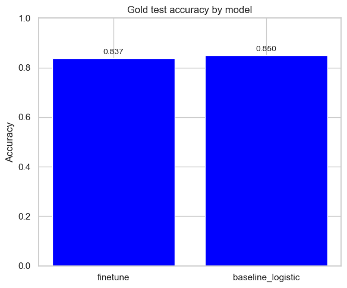
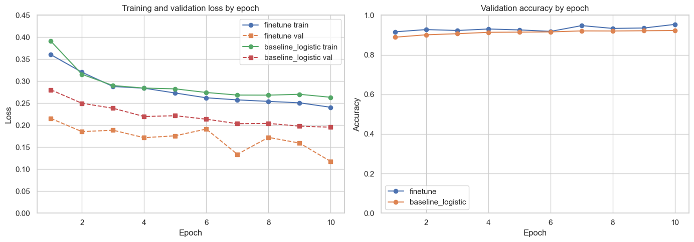
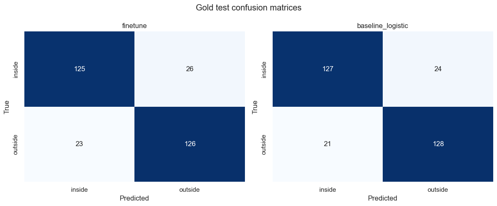
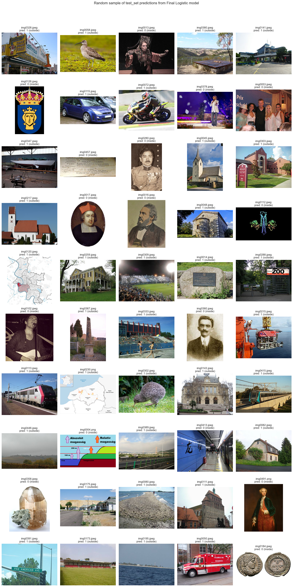

# Wikimedia Project

Indoor vs outdoor image classification for the course "Selected Topics in Deep Learning".

## 1. What Are We Building?

My solution pipeline:

1. Build a candidate image pool from WIT.
2. Label a small gold set manually (i did about 1500 images).
3. Split gold data into train/val/test.
4. Pseudo-label the remaining pool with CLIP.
5. Train and compare two ResNet50 variants (frozen logistic head vs full fine-tune).
6. Train final frozen model on pool + gold train/val and evaluate on held-out gold test.

## 2. How to reproduce results

Run commands from the project root.

### Install dependencies

```bash
python -m pip install -r requirements.txt
```

### Create candidate pool

```bash
python scripts/create_candidate_pool.py --output_dir pool --target_total 20000
```

### Label gold set

```bash
python scripts/label_app.py --input_dir pool --output_csv labels_gold.csv --limit 500
```

### Split gold labels into train/val/test

```bash
python scripts/split_gold.py --input_csv labels_gold.csv --out_dir pool/splits --test_size 200 --val_size 160 --copy_images
```

### Pseudo-label pool and build train/val image folders

```bash
python scripts/pseudo_label_pool.py --pool_dir pool --splits_dir pool/splits --train_dir train_set --val_dir val_set
```

### Train baseline logistic model (frozen backbone)

```bash
python scripts/train_resnet.py --train_dir train_set --val_dir val_set --epochs 10 --batch_size 32 --lr 3e-4 --weight_decay 1e-4 --num_workers 0 --seed 42 --freeze_backbone --use_gold --gold_splits_dir pool/splits --output_dir checkpoints/baseline_logistic
```

### Train full fine-tune model

```bash
python scripts/train_resnet.py --train_dir train_set --val_dir val_set --epochs 10 --batch_size 32 --lr 3e-4 --weight_decay 1e-4 --num_workers 0 --seed 42 --use_gold --gold_splits_dir pool/splits --output_dir checkpoints/full_fine_tune
```

### Train final logistic model (pool + gold train/val, gold test held out)

```bash
python scripts/train_final_resnet.py --pool_dir pool --gold_splits_dir pool/splits --epochs 12 --batch_size 32 --lr 3e-4 --weight_decay 1e-4 --num_workers 0 --seed 42 --output_dir checkpoints/final_logistic
```

### Run notebook analysis and export final test predictions

Open and run all cells in:

- [notebooks/main.ipynb](notebooks/main.ipynb)

Notebook generates final predictions file:

- [predictions.txt](predictions.txt)

## 3. Results and Evaluation

### 3.1 Gold test accuracy



### 3.2 Training curves (loss and validation accuracy)



### 3.3 Gold test confusion matrices



### 3.4 Example predictions on final test set


